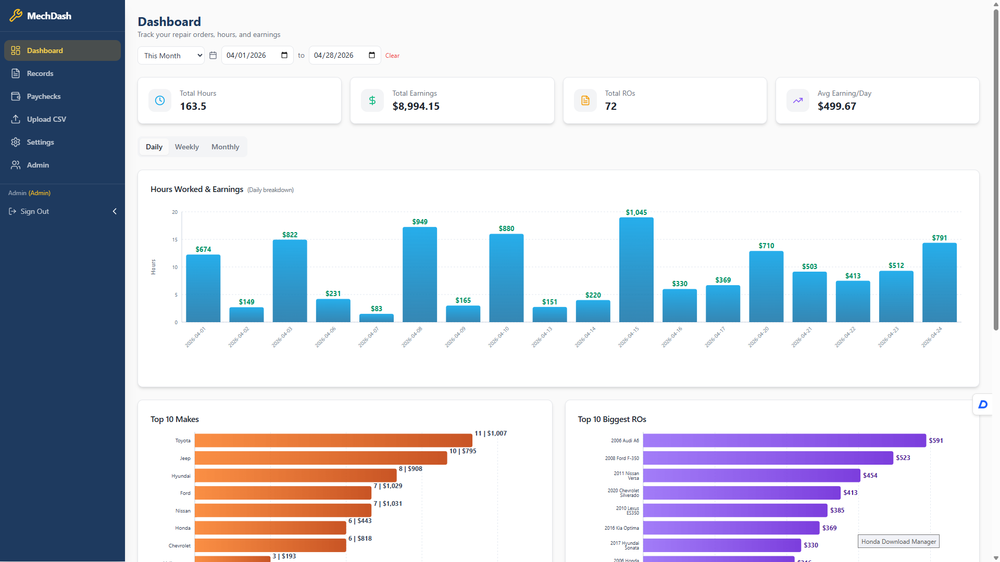
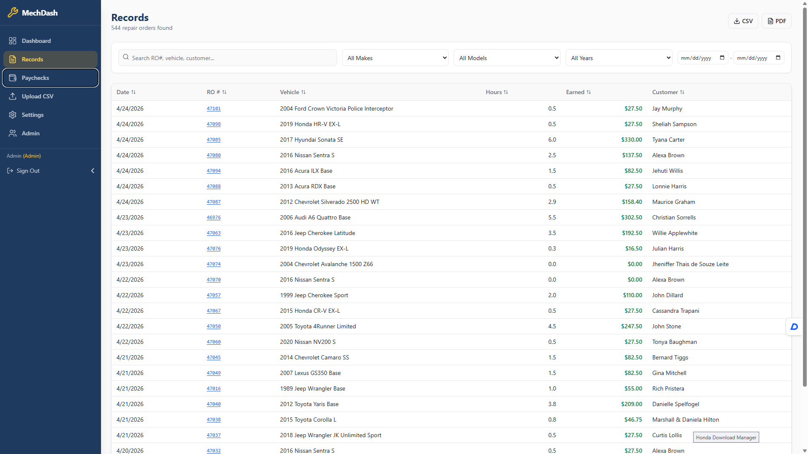
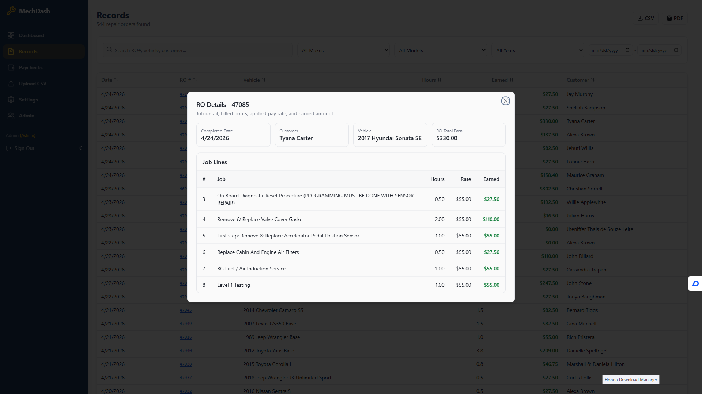
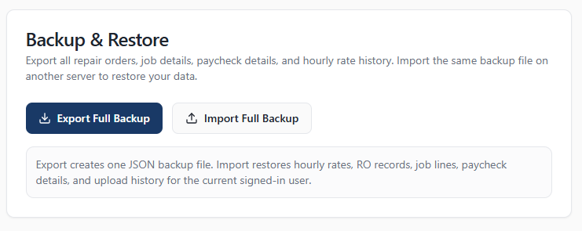

# 🧰 MechDash — Technician Earnings Dashboard


> Turn Tekmetric CSV into a clean, job-level paycheck system with accurate earnings tracking.

---

## 📸 Screenshots

### Dashboard



### Records Table



### RO Details Popup



### Settings (Backup & Rates)



> 📌 Tip: Create `/docs/screenshots/` folder and drop images there.

---

## 🚀 Features

### 🔧 Core

* Upload Tekmetric CSV
* Auto-group by Repair Order (RO)
* Store **job-level detail**
* Calculate earnings using **historical pay rates**

### 📊 Dashboard

* Weekly / Monthly / Yearly summaries
* Total hours & earnings
* Fast performance (pre-aggregated)

### 📋 Records

* Scrollable table
* Filters (date, vehicle, search)
* Click RO → popup detail
* Job-level:

  * description
  * hours
  * applied rate
  * earned

### ⚙️ Settings

* Profile management
* Change password
* Hourly rate history (effective dates)

### 💾 Backup System

* Export full JSON backup
* Import to restore on another server
* Includes:

  * RO data
  * job lines
  * earnings
  * hourly rates

---

## 🧱 Tech Stack

| Layer      | Tech                 |
| ---------- | -------------------- |
| Frontend   | Next.js 14 + React   |
| UI         | Tailwind + shadcn/ui |
| Backend    | Next.js API routes   |
| Database   | PostgreSQL + Prisma  |
| Charts     | Recharts             |
| Deployment | Docker               |

---

## 📁 Project Structure

```text
app/
  (main)/
    dashboard/
    records/
    settings/
  api/
    upload/
    records/
    rates/
    backup/
      export/
      import/

prisma/
  schema.prisma

lib/
  earnings.ts
  csv-parser.ts

docker-compose.yml
Dockerfile
```

---

## ⚙️ Local Setup

### 1. Install

```bash
npm install
```

### 2. Prisma

```bash
npx prisma generate
npx prisma migrate dev
```

### 3. Run

```bash
npm run dev
```

---

## 🐳 Docker Setup

### Build & Run

```bash
docker compose up -d --build
```

### Logs

```bash
docker logs -f <container>
```

---

## 📊 Data Model

### 🧾 RoRecord (parent)

* roNumber
* roCompletedDate
* vehicleDescription
* billedHours (total)
* totalSale

### 🔩 RoJobLine (child)

* jobDescription
* billedHours
* appliedRate
* earnedAmount

👉 Each CSV row = **one job line**

---

## 💰 Earnings Logic

```ts
earned = billedHours * hourlyRate
```

Rate is selected based on:

```ts
effectiveFrom <= RO date <= effectiveTo
```

Default fallback:

```ts
45/hr
```

---

## 📥 CSV Upload

Required columns:

* RO Number
* RO Completed Date
* Vehicle Description
* **Job** ✅ (important)
* Billed Hours

### Behavior

* Groups rows → one RO
* Stores each row → job line
* Prevents duplicates

---

## 💾 Backup & Restore

### Export

```
GET /api/backup/export
```

### Import

```
POST /api/backup/import
```

### Includes:

* hourlyRates
* roRecords
* jobLines
* uploadHistory

---

## 🔁 Move to New Server

1. Export backup from old server
2. Deploy app on new server
3. Import backup

✅ Done

---

## 🔧 Git Workflow (Recommended)

Before changes:

```bash
git add .
git commit -m "stable before feature"
git checkout -b feature/new-feature
```

After:

```bash
git commit -am "add feature"
git checkout main
git merge feature/new-feature
```

---

## 🧠 Common Issues

### ❌ Job shows "-"

Fix:

```ts
const jobDesc = row['Job']
```

---

### ❌ Build error (Prisma)

Fix:

* remove invalid field in `orderBy`

---

### ❌ No job detail in popup

Fix:

* re-upload CSV after schema update

---

## 🚀 Roadmap

* 📊 Paycheck report (weekly/monthly)
* 🧠 Smart CSV auto-mapping
* 👥 Multi-user roles
* ☁️ Cloud deployment
* 📱 Mobile optimization

---

## 🧩 Philosophy

* Fast RO summaries
* Accurate job-level detail
* Store computed earnings (not recalc every time)
* Easy migration (JSON backup)

---

## 📜 License

MIT

---

## 🙌 Author

Built for real-world technician workflow
— Flat-rate focused, fast, and practical

---

## ⭐ Support

If this helps your workflow:

* Star the repo ⭐
* Fork it 🍴
* Improve it 🔧

---

If you want next:
👉 I can generate **real screenshot mockups**
👉 Or add **GitHub Actions CI (auto build + deploy)**
